# 토크토피아: 실시간 번역 랜덤 채팅 프로젝트
> **SSAFY 9기 공통프로젝트 - 실시간 번역 기능을 탑재한 랜덤 화상 채팅 웹 <br>
개발 기간 : 23.07.10~23.08.18**

## 팀 소개

||||||
|-|-|-|-|-|
|팀장 우수인 BE<br>@wbo1026<hr>|팀원 정재욱 BE<br>@wodnr8462<hr>|팀원 이진서 BE<br>@lalaququ<hr>|팀원 김나연 FE<br>@nayeon0016<hr>|팀원 김준석 FE<br>@pepaa15<hr>|

## 프로젝트 소개

**본 프로젝트는 사용자에게 실시간 번역 및 자막 송출 기능을 통해 언어의 장벽을 넘어서 소통할 수 있는 경험을 제공합니다.**

**토크토피아**는 크게 다음과 같은 기능을 지원합니다
1. 랜덤 화상 채팅
2. 친구와 화상 채팅

## 시작 가이드
### 요구사항
버전에 맞는 환경이 필요합니다.

FE
|사용기술| 버전 |
|-|-|
|React |18.2.0
 Node.js|18.16.1
TypeScript | 
React-Redux|  8.1.1 


BE
|사용기술|버전|
|-|-|
| Java | 11 |
| Springboot | 2.7.14 |
| gradle | 8.1.1 |
| Openvidu | 2.19.0 |
| FCM | 7.1.1 |
| Lombok | 1.18.24 |
| websocket | 2.7.2 |

#### 백엔드
```
$ cd BE/Talktopia/talktopia
$ mvn spring-boot:run
$ cd ../talktopia_chat
$ mvn spring-boot:run
```

#### 프론트엔드
```
$ cd FE/talktopia
$ npm install
$ npm run start
```
## 사용 기술
### Environment

    

### Config


### Development
#### - Back-End


#### - Front-End
    

### 외부 API


### Management


### Communication


### Deploy


## 화면 구성

### 시작화면
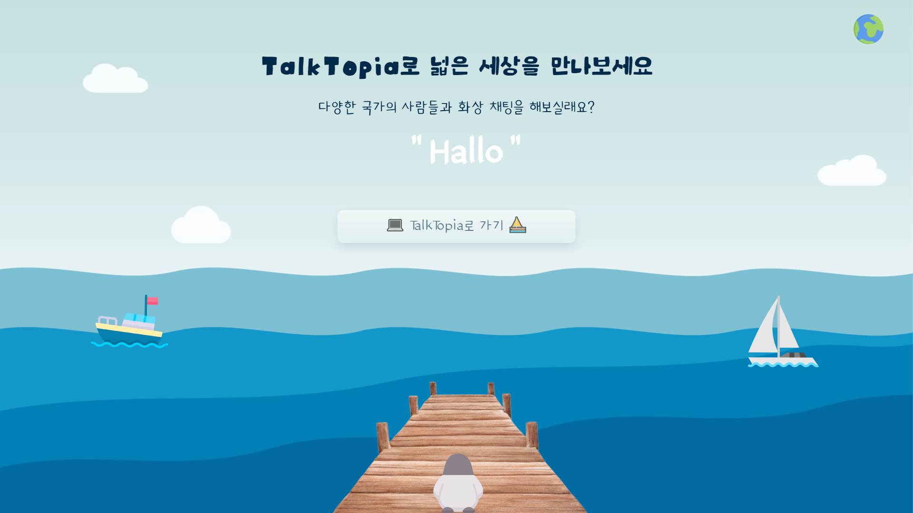
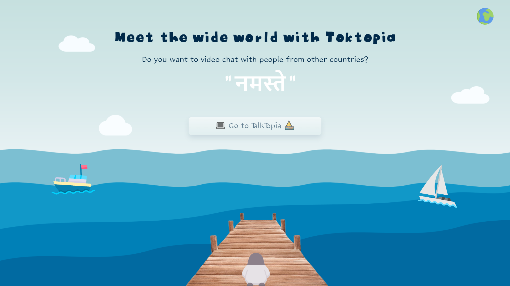

### 로그인화면
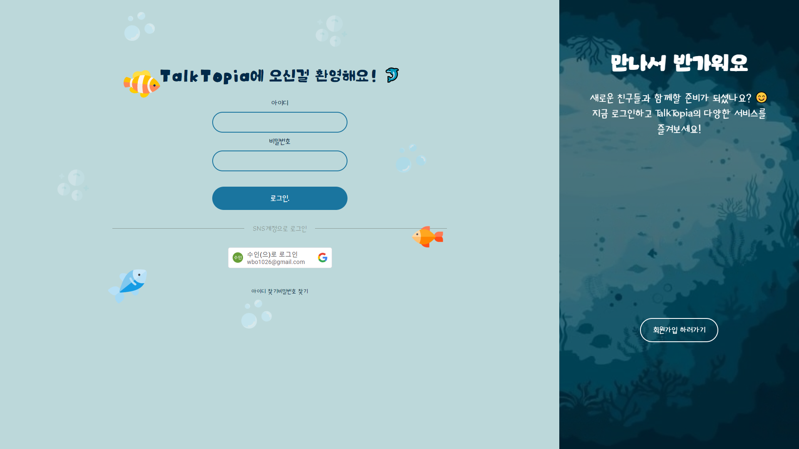

### 메인화면
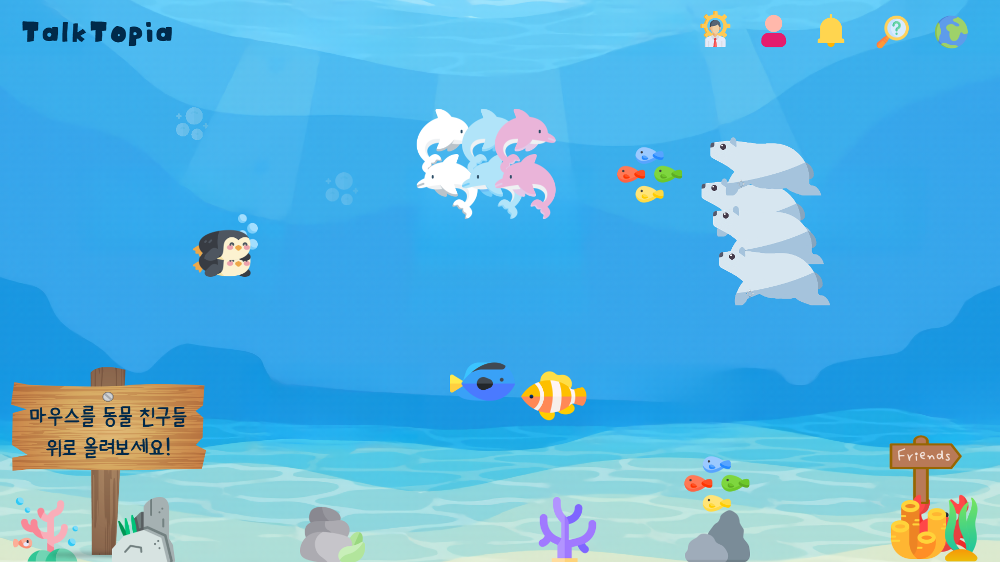

### 화상채팅 화면
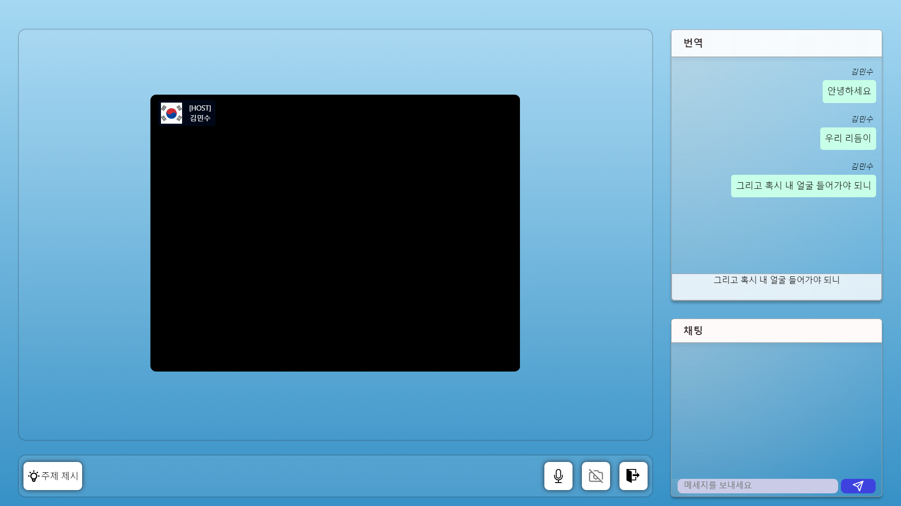
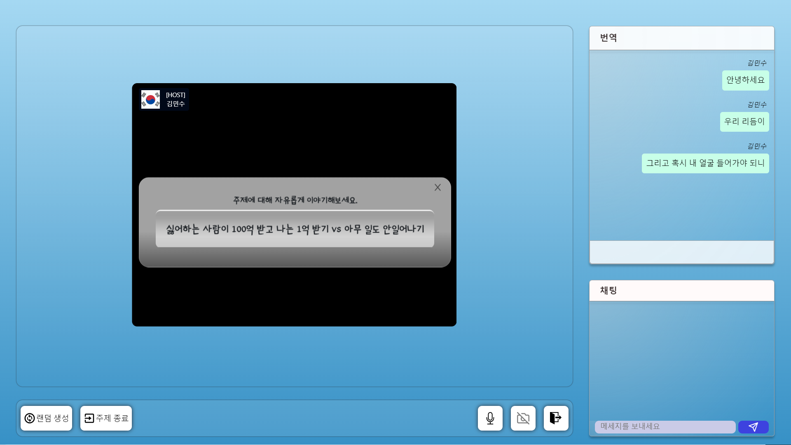

### 친구/채팅 화면
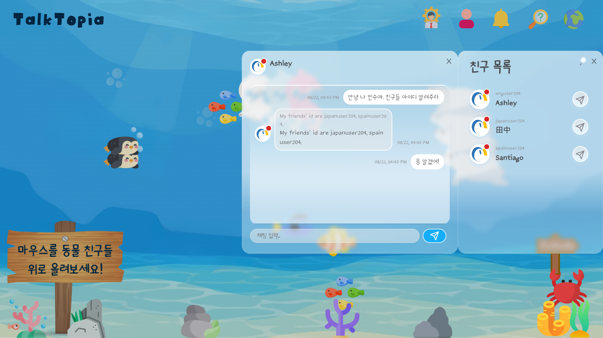
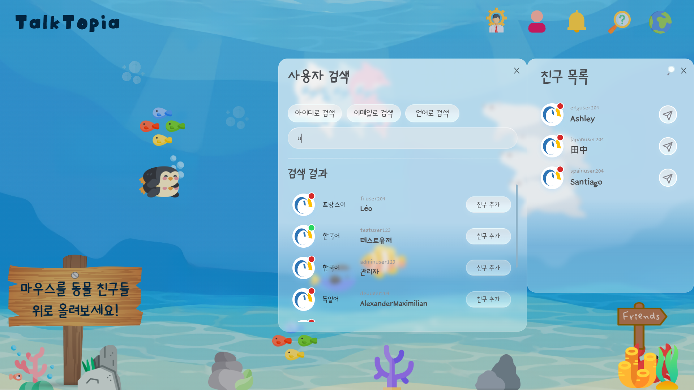

### 관리자) 로그 확인 화면
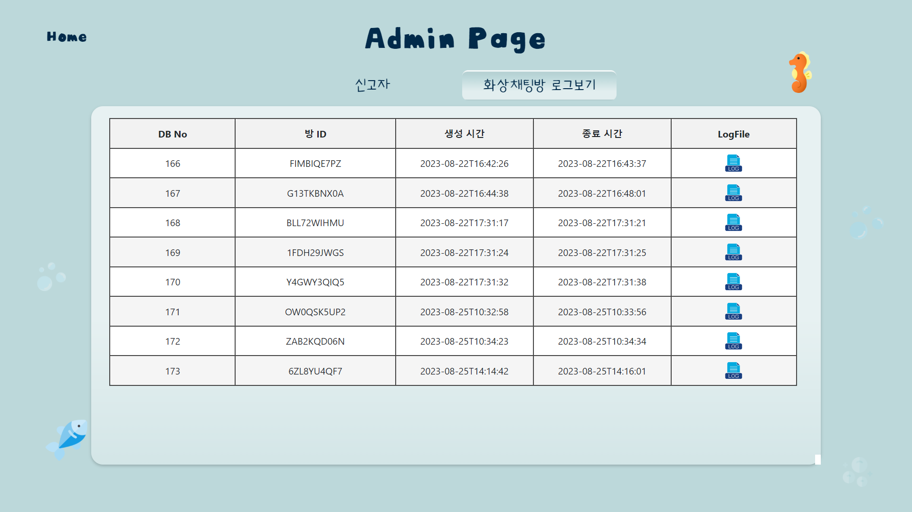

### 관리자) 신고 확인 화면
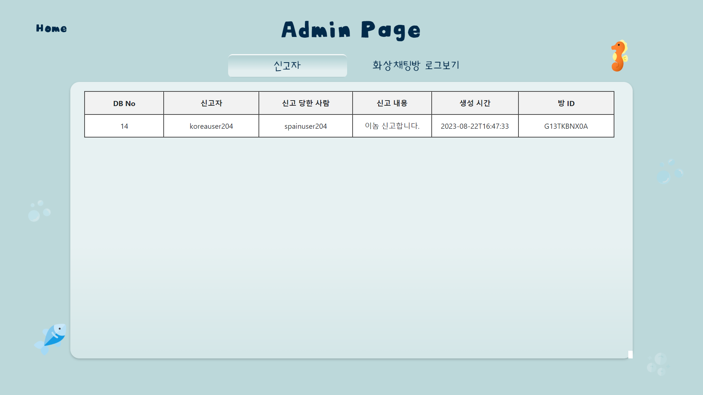

### 정보 수정 화면
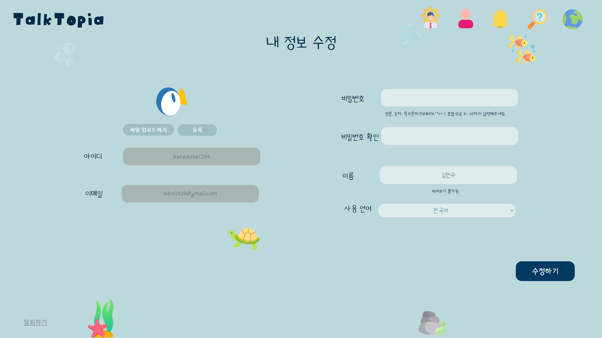

### FAQ 화면
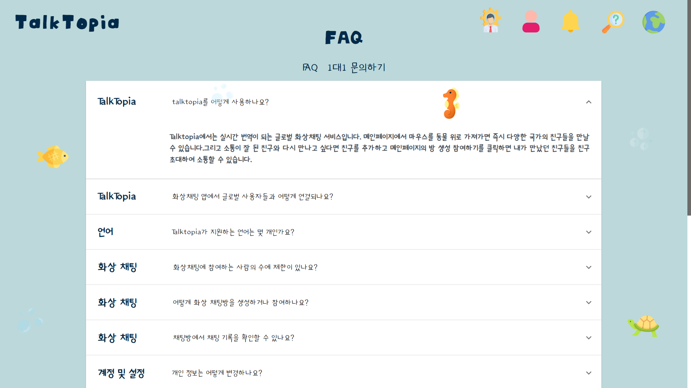

### 1:1문의 화면
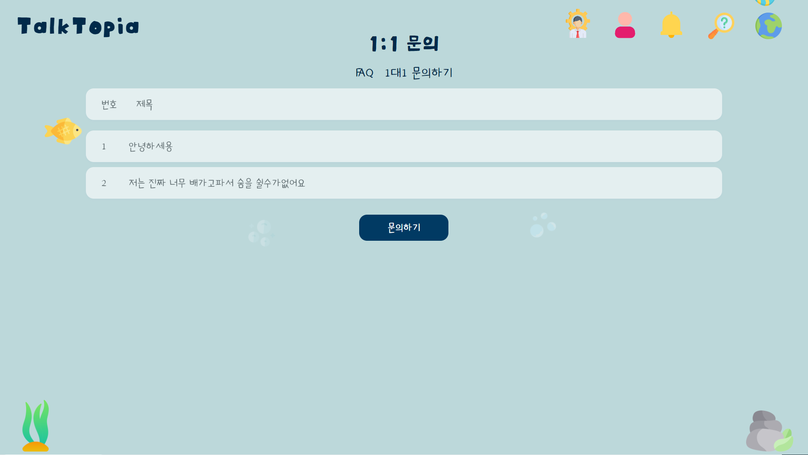


### 화상채팅 초대 화면
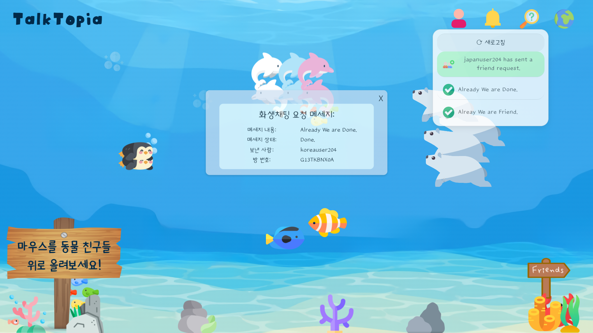

### 로그아웃 화면
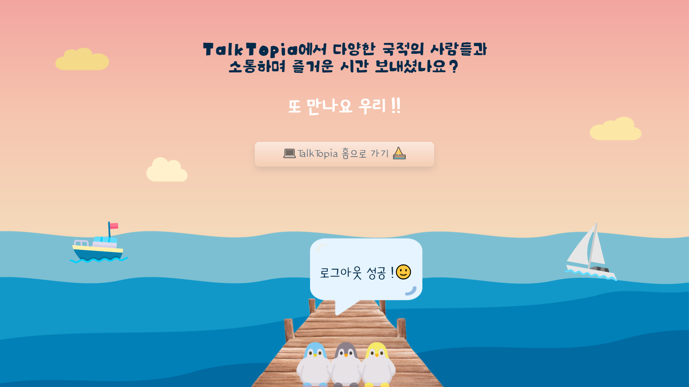


## 주요 기능
### 랜덤 화상 채팅
각국의 사용자와 화상 채팅을 즐겨보세요. 실시간 번역 기능을 통해 언어의 어려움을 해소해 드립니다. <br>
**주제 랜덤 선정 기능**을 이용해 글로벌 유저와 더 친밀해지세요!
<br><br>
**주제 랜덤 선정 기능**을 이용하면 매칭된 상대와 대화할 주제를 선정해 줍니다.<br>
대화 주제를 고민하는 시간을 줄이고 상대방의 관심사를 빠르게 확인할 수 있습니다.


### 친구와 화상 채팅
랜덤 화상 채팅에서 친해진 상대와 친구를 맺어 따로 화상 채팅할 수 있습니다.<br>


## 아키텍쳐

### FLOW
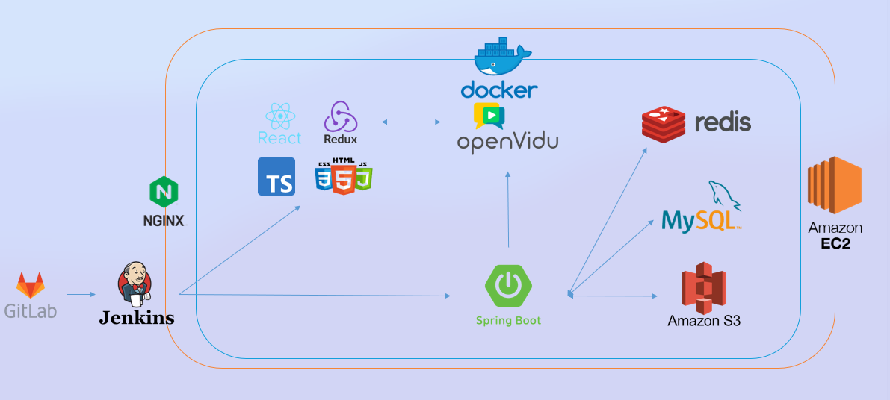

### ERD


